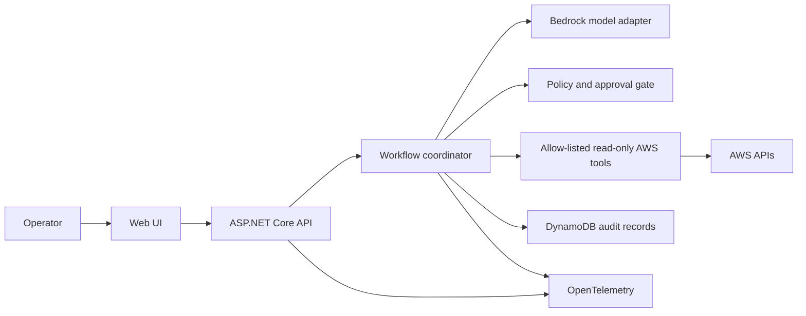
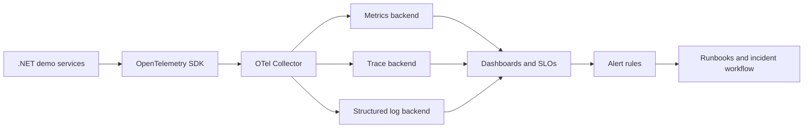
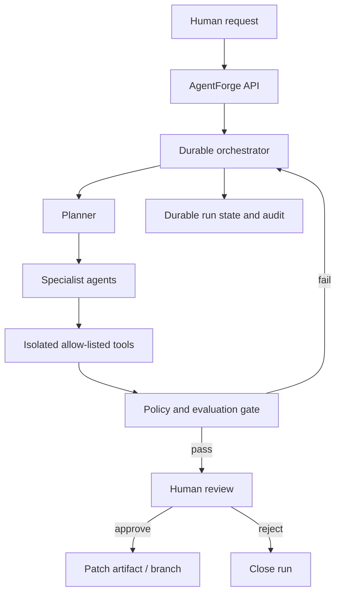

# GitHub Profile and Portfolio Strategy

**Positioning:** Cloud-Native Software Engineer with a .NET foundation and a growing, evidence-backed focus on AWS, AI, and platform engineering.

This plan reflects the public account and repositories inspected on 6 October 2026. The profile is new, and the current public portfolio is small. The goal is not to imply three to five years of experience; it is to make a credible record of focused growth, shipped work, and engineering decisions.

## Profile Branding

GitHub exposes a short bio rather than a separate headline field. Use the first line of the profile README as the headline and the GitHub bio for a concise, searchable summary.

- **Headline:** Graduate Software Engineer at Sage | C#/.NET | Cloud-Native Systems | AI & Platform Engineering
- **Bio:** Graduate Software Engineer at Sage | C#/.NET, Angular & TypeScript | Learning AWS and distributed systems | Johannesburg, South Africa
- **Profile README:** See [`github-profile/README.md`](../github-profile/README.md). It separates current professional experience, learning, and planned work rather than turning aspirations into claims.
- **Discoverability:** Set the GitHub location to Johannesburg, South Africa; set the website to [tumelodev-arch.github.io](https://tumelodev-arch.github.io/), now verified live; add focused repository topics and descriptions.

## Repository Audit

Scores are current public-facing readiness scores out of 10, not assessments of private or employer work. No source history or project evidence was available for repos beyond their public metadata/content.

| Repository | Decision | Score | Strengths | Weaknesses and credibility risks | Improvements |
| --- | --- | ---: | --- | --- | --- |
| [`tumelodev-arch`](https://github.com/tumelodev-arch/tumelodev-arch) (profile README) | **UPDATE** | 6/10 | The public README is now structured, candid, searchable, and separates demonstrated work from planned projects. | Still only a profile README; no finished public engineering project backs the flagship plans. The GitHub account bio remains the old wording because the current CLI token lacks the `user` scope. | Update the GitHub bio and profile website manually; add substantive projects only as they become runnable and verifiable. |
| [`tumelodev-arch.github.io`](https://github.com/tumelodev-arch/tumelodev-arch.github.io) | **UPDATE** | 6/10 | Custom multi-page site, accessible skip link/navigation, CV, real employer work summarized responsibly, no framework/build burden; Pages now verified live, repository homepage and focused topics are set. | Root README lacks contribution/architecture docs and automated checks. The site presents learning exercises, not substantial public cloud projects. | Add link validation/accessibility checks; create public case studies only when backed by source code; keep employment details within disclosure policy. |

**KEEP:** both repositories. **ARCHIVE:** none currently. **DELETE:** none. There are only two public repositories, so there are no verified duplicate projects or unfinished application repositories to classify. The planned flagships are not yet repositories. Reassess after the next three months of shipping work.

### Remaining profile actions

1. The GitHub bio currently remains `Software engineer at Sage. Angular, .NET, TypeScript, AWS. Writing down what I learn.` Update it to the prepared, learning-qualified bio; the CLI token used here cannot change account profile fields without the `user` scope.
2. Set the GitHub profile website field to the now-verified `https://tumelodev-arch.github.io/`. The portfolio repository homepage and focused topics are already set.
3. The profile README TODOs and inaccurate Next.js reference have been removed.
4. Do not represent Sage/Azure DevOps work as AWS experience, or design exercises as deployed AI products.
5. Avoid generating empty repos, vanity badges, activity widgets, or cloned tutorial projects just to increase repository count.

## Repository Standard

Apply this to substantive projects; keep small learning experiments clearly labeled and lightweight. A repo is feature-ready only when a reviewer can understand the problem, run tests, reproduce a deployment, and see what remains unknown.

### Required README sections

1. **Overview** — user/problem, intended audience, status, scope, and limitations.
2. **Architecture** — component diagram, data flow, trust boundaries, key trade-offs; link `ARCHITECTURE.md`.
3. **Features** — implemented behavior only; distinguish planned work.
4. **Tech Stack** — versions and why selected.
5. **Local Setup** — prerequisites, commands, configuration, seed data, test commands.
6. **Cloud Deployment** — account prerequisites, Terraform commands, cost estimate, teardown, and manual approvals.
7. **Screenshots** — only when visual output matters; no fabricated mock screenshots.
8. **Future Improvements** — ordered backlog, known limitations, and operational risks.

### Required repository files

- `CONTRIBUTING.md` — local workflow, style, tests, PR checklist, issue reporting, security contact.
- `LICENSE` — choose deliberately; do not assume every employer-related artifact can be open-sourced.
- `ARCHITECTURE.md` — context, containers/components, request/event flows, data and security boundaries, failure modes, ADR links.
- `CHANGELOG.md` — notable user-visible changes, following Keep a Changelog conventions.
- `.github/workflows/` — PR CI (format/build/unit/integration tests, coverage, container build); protected release/deploy workflow with environment approval and AWS OIDC rather than long-lived keys.
- `tests/`, `Dockerfile`, `infra/terraform/`, `.editorconfig`, `global.json`/tool versions, secret-safe `.env.example` as applicable.

### Quality gates and badges

- Require a green CI check and review before merge; protect `main`.
- Run deterministic unit tests on every PR; integration tests against disposable dependencies; emit Cobertura coverage and set a justified baseline/threshold.
- Build and scan the container; pin actions and base images, generate an SBOM, and publish immutable release tags.
- Use SonarCloud/SonarQube quality gates when configured (do not publish a badge that is not connected to a real project).
- Add OpenTelemetry traces/metrics and structured JSON logs with correlation/trace IDs; never log credentials, prompts containing secrets, or sensitive payroll data.
- Add only truthful badges: CI, coverage, license, and a maintained release badge. Do not use badges as a substitute for evidence.

The reusable starter artifacts are under [`templates/repository-standard/`](../templates/repository-standard/): .NET CI/coverage, optional SonarCloud, Terraform validation, a protected ECS OIDC deploy workflow, and a Docker/task-definition example. Configure repository variables/secrets and environment approvals; these are templates, not a claim that this static portfolio needs a .NET container or Terraform deployment.

## Ten-Repository Portfolio Target

This is a target portfolio, not a claim that these ten repos exist today. Build only when each has a distinct purpose; use a monorepo for closely coupled services rather than splitting components to inflate counts.

| # | Repository concept | Positioning evidence | Priority |
| ---: | --- | --- | --- |
| 1 | **CloudOps AI Assistant** | .NET service, AWS read-only operations, approval workflow, audit trail, policy controls | Flagship 1 |
| 2 | **SentinelOps Monitoring Platform** | OpenTelemetry, SLOs, alerting, runbooks, service health views | Flagship 2 |
| 3 | **AgentForge** | Durable multi-agent orchestration, tool isolation, human review, eval harness | Flagship 3 |
| 4 | .NET Resilient Worker | Idempotency, retries, outbox, queue processing, integration tests | Build before/alongside flagships |
| 5 | AWS ECS/Fargate Reference Platform | Terraform modules, ALB, autoscaling, IAM, logs, cost/teardown | Reusable infra evidence |
| 6 | Serverless Event Intake | Lambda, API Gateway, DynamoDB, DLQ, alarms, replay and idempotency | AWS breadth |
| 7 | RAG Evaluation Workbench | Ingestion, retrieval, citations, test corpus, quality/cost/latency evaluation | AI engineering |
| 8 | OpenTelemetry .NET Starter | SDK conventions, trace/log correlation, sampling, dashboards, demo services | Maintainer utility |
| 9 | Delivery Guardrails Action | Reusable GitHub Action for .NET checks, SBOM, container and IaC validation | Platform engineering |
| 10 | Distributed Systems Failure Lab | Fault injection/simulations for timeouts, retries, partitions, and recovery | Systems fundamentals |

Skip todo, calculator, weather, and basic CRUD apps. A small API is appropriate only as a component of a measurable reliability/cloud/AI question.

### AWS evidence map

All items below are planned portfolio evidence, not current production experience. Build and document the services rather than adding them as unconnected badges.

| AWS service/capability | Planned evidence project | What to demonstrate |
| --- | --- | --- |
| ECS + Fargate | CloudOps AI Assistant; SentinelOps | Container service, health checks, scaling, safe rollout and rollback |
| EC2 + Auto Scaling + launch templates | ECS/Fargate Reference Platform | Versioned launch template, autoscaling policy, load testing, replacement and rollback |
| Application Load Balancer | CloudOps AI Assistant; Reference Platform | TLS/health checks, target health, routing and failure behavior |
| Lambda | Serverless Event Intake | Idempotent handler, retries, DLQ/replay and cold-start/latency measurements |
| DynamoDB | CloudOps AI Assistant; Serverless Event Intake | Partition/access-pattern design, conditional writes, TTL and failure behavior |
| CloudWatch | All deployed examples | Structured logs, metrics/alarms, dashboards, retention and actionable runbooks |
| IAM | All deployed examples | Least-privilege task/execution roles, OIDC deploy role, permission-denied tests |

This links EC2 evidence to the existing launch-template learning exercise while making a separate deployable example the next proof point.

## Flagship Blueprints

### 1. CloudOps AI Assistant

**Purpose:** Safely translate an operator question into a proposed cloud investigation/action. Start read-only. Any mutation requires policy validation and explicit human approval; the model never receives AWS credentials.

**Architecture:** React or minimal web UI → ASP.NET Core API → request/auth boundary → workflow coordinator → model adapter (Amazon Bedrock behind an interface) → allow-listed tools (read-only AWS APIs) → policy/approval service → append-only audit events → DynamoDB. SQS/EventBridge carries long-running work; OpenTelemetry traces the request and each tool call. The first version can keep deterministic workflow execution in-process and introduce a queue only when durability is required.

**Folder structure:** `src/CloudOps.Api`, `src/CloudOps.Application`, `src/CloudOps.Domain`, `src/CloudOps.Infrastructure`, `src/CloudOps.Worker`, `tests/CloudOps.UnitTests`, `tests/CloudOps.IntegrationTests`, `tests/CloudOps.EvaluationTests`, `infra/terraform`, `docs/adr`, `deploy/`, `.github/workflows/`.

**Tech stack:** C#/.NET 10, ASP.NET Core, AWS SDK, Bedrock model adapter, DynamoDB, SQS/EventBridge if needed, OpenTelemetry, structured logging, Docker, Terraform, xUnit, Testcontainers.

**AWS / deployment:** ECS Fargate behind an ALB for API/worker; IAM task roles with least privilege; DynamoDB for state/audit; SQS + DLQ for durable jobs; CloudWatch alarms/log retention; KMS encryption; Secrets Manager for provider configuration; autoscaling on queue depth/CPU. Deploy dev first; use separate AWS accounts/environments for higher stages. Provide Terraform destroy and cost guardrails.

**CI/CD:** PR format/build/unit/integration/evaluation tests; coverage artifact and quality gate; container scan + SBOM; Terraform fmt/validate/plan; deploy ephemeral or dev on protected workflow using GitHub OIDC; approval before production-like deployment; smoke test and rollback instructions.

**Roadmap:** (1) Threat model and deterministic read-only tool/API; (2) authenticated API, audit model, fake model adapter; (3) Bedrock adapter, prompt/version registry and evaluation set; (4) approval gate, retries, idempotency, rate limits; (5) ECS/DynamoDB/SQS Terraform deployment; (6) dashboards, incident drills, documented safety limits. Do not add write tools until threat model and approval semantics are tested.

### 2. SentinelOps Monitoring Platform

**Purpose:** Demonstrate how a small service platform is instrumented and operated, not another dashboard without telemetry semantics.

**Architecture:** Sample .NET services emit OTLP traces/metrics/logs → OpenTelemetry Collector → managed or self-hosted telemetry backends; a lightweight control API stores service/SLO metadata and alert rules. Include golden signals, trace exemplars, service-level objectives, alert routing, synthetic checks, and runbooks. Keep telemetry payloads free of personal/customer data.

**Folder structure:** `src/Sentinel.Api`, `src/Sentinel.Worker`, `src/Sentinel.ControlPlane`, `src/Sentinel.Telemetry`, `tests/`, `observability/collector`, `observability/dashboards`, `observability/alerts`, `infra/terraform`, `docs/runbooks`, `docs/adr`.

**Tech stack:** .NET 10, OpenTelemetry SDK/Collector, Prometheus-compatible metrics, Grafana dashboards, Tempo/Jaeger traces, structured JSON logs, Docker Compose for local mode, Terraform for AWS mode, xUnit/Testcontainers.

**AWS / deployment:** ECS Fargate services; ALB for the API; CloudWatch Container Insights/log export and alarms; S3 for long-retention telemetry/archive where appropriate; DynamoDB for control-plane metadata if needed; IAM task roles, KMS, autoscaling. Be explicit about telemetry storage cost/retention. Offer local compose deployment before managed AWS backends.

**CI/CD:** Unit and integration tests, telemetry contract tests, dashboard/alert JSON validation, container scan/SBOM, Terraform plan, deploy to a disposable demo environment, synthetic smoke checks, and teardown. Treat alert noise and missing-data behavior as tested acceptance criteria.

**Roadmap:** (1) Instrument one API with traces/metrics/logs; (2) collector + local dashboards; (3) define latency/error SLOs and burn-rate alerts; (4) add synthetic checks and actionable runbooks; (5) deploy sample services on ECS; (6) inject latency/failure and publish incident review with measured recovery.

### 3. AgentForge Multi-Agent Engineering Team

**Purpose:** A controlled engineering workflow where specialized agents analyze a task, propose a patch, run sandboxed checks, and request human review—never silently merge or deploy.

**Architecture:** ASP.NET Core API → durable workflow state machine → planner → specialist agents (requirements, code review, tests, documentation) → allow-listed tools in isolated containers → evaluation/policy gate → human approval UI → patch artifact. Persist run state and tool outputs; use a versioned model/provider abstraction. Bound tokens, time, tool calls, and file access. Keep deterministic orchestration as the control plane; agents are untrusted workers.

**Folder structure:** `src/AgentForge.Api`, `src/AgentForge.Orchestration`, `src/AgentForge.Agents`, `src/AgentForge.Tools`, `src/AgentForge.Policy`, `src/AgentForge.Persistence`, `src/AgentForge.Worker`, `tests/AgentForge.UnitTests`, `tests/AgentForge.IntegrationTests`, `tests/AgentForge.EvaluationTests`, `evals/`, `infra/terraform`, `docs/threat-model.md`, `docs/adr`.

**Tech stack:** C#/.NET 10, ASP.NET Core, durable workflow/queue abstraction, provider-neutral LLM interface with Bedrock implementation, PostgreSQL or DynamoDB for run state (choose one from consistency/query needs), SQS for jobs, Docker sandbox, OpenTelemetry, xUnit, Testcontainers.

**AWS / deployment:** ECS Fargate API and workers; SQS + DLQ for orchestration; DynamoDB or RDS PostgreSQL for durable state; S3 for immutable artifacts; Bedrock via scoped IAM permissions; CloudWatch alarms/logs; KMS; Secrets Manager only for external credentials; ALB and autoscaling. Enforce tenant/repository isolation and data retention.

**CI/CD:** Unit/integration tests; fixed evaluation set for correctness, cost, latency, and tool misuse; prompt-injection and permission-boundary tests; sandbox image scans; Terraform plan; OIDC deployment with approval; audit that no automated workflow can merge/deploy code.

**Roadmap:** (1) One deterministic pipeline with mock agents; (2) tool registry and isolated read-only tools; (3) versioned model adapter and evaluation harness; (4) patch generation in temporary branch, no merge; (5) human approval and durable state; (6) adversarial testing, quotas, observability, AWS deployment. Expand roles only when evaluation proves a benefit over a single-agent baseline.

## 90-Day Roadmap

### Days 1–30: Repair the front door and ship one vertical slice

- Keep the published README; manually update the account bio/profile website fields (location is set) and link the now-verified GitHub Pages site.
- Add substantive public contribution/security/license decisions as projects are created; repository description, homepage, topics, and README cross-links are now in place.
- Select CloudOps AI Assistant as the first flagship; publish threat model, architecture, scope, and acceptance criteria before implementation.
- Build a local .NET vertical slice with fake cloud/model adapters, unit + integration tests, structured logs, and a runnable Docker image.

### Days 31–60: Make it reliable and reproducible

- Add policy-enforced read-only AWS tools, audit records, OpenTelemetry, coverage, CI, dependency/container scanning, and Terraform dev deployment.
- Run failure tests: timeout, provider unavailable, duplicate request, malformed model output, and permission denial.
- Publish a short engineering note with decisions, measured results, limitations, and cost estimate. Ask for review before adding features.

### Days 61–90: Operate, document, and contribute

- Add a human approval path and evaluation corpus; complete a deployment/teardown rehearsal and document rollback.
- Improve docs, diagrams, accessibility, issue templates, releases, and security reporting; resolve all starter issues.
- Make two small, useful upstream contributions in .NET/AWS/OpenTelemetry ecosystems, following maintainer guidance.
- Decide whether SentinelOps or AgentForge is the next build based on feedback and evidence—not repository-count targets.

**Weekly cadence:** one small releasable increment, one test/operability improvement, one written decision or learning note, and a review of open issues. Keep production employment details confidential.

## Technical Reputation and Open-Source Strategy

- Prefer a few complete systems over many demos: runnable, tested, documented, observable, deployable, cost-aware, and explicitly limited.
- Show evidence: CI status, test results, coverage trend, architecture decisions, threat model, deployment walkthrough, teardown, and a real trade-off discussion.
- Use conventional commits/releases, meaningful issues and PRs, changelog entries, and prompt responses to user reports.
- Contribute first through docs, reproducible bug reports, tests, small fixes, and issue triage in .NET, AWS tooling, OpenTelemetry, and agent frameworks. Read `CONTRIBUTING.md`, avoid drive-by refactors, and maintain follow-through.
- Never publish employer source, customer/payroll data, internal screenshots, or non-public system details. Keep public work independently built and clearly separate.

## What to Build After the Flagships

1. Package common telemetry and CI guardrails as a maintained .NET starter/action only after they are proven in two projects.
2. Add the serverless event-intake project to demonstrate Lambda, DynamoDB, IAM, DLQ, and replay with measurable failure handling.
3. Publish the RAG evaluation workbench to show retrieval quality and grounded answers, not just a model wrapper.
4. Build failure-injection labs around idempotency, retries, timeouts, partitions, and recovery; publish the measurements.
5. Turn repeated deployment patterns into small Terraform modules only after real use, versioning, tests, examples, and support expectations exist.
